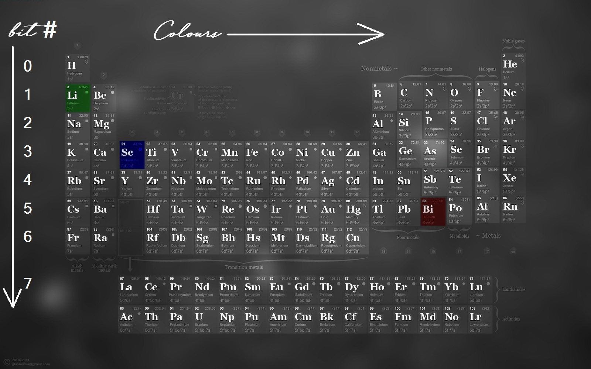

# GreHack 2022 - Stegano

A couple of writeups for the stegano challenges of the GreHack CTF 2022.

<!-- more -->

## Let’s do Pika Pika

> This animal tries to tell us something…
>
> Author: Jonathan MAROTTA#9819 / eXraZ


```
❯ binwalk --dd='.*' Lets-do-Pika-Pika.jpg

DECIMAL       HEXADECIMAL     DESCRIPTION
--------------------------------------------------------------------------------
0             0x0             JPEG image data, JFIF standard 1.01
68786         0x10CB2         End of Zip archive, footer length: 22
```

```
❯ file 10CB2
10CB2: Zip archive data (empty)
❯ unzip 10CB2
Archive:  10CB2
error [10CB2]:  missing 11731 bytes in zipfile
  (attempting to process anyway)
error [10CB2]:  attempt to seek before beginning of zipfile
  (please check that you have transferred or created the zipfile in the
  appropriate BINARY mode and that you have compiled UnZip properly)
```

Let's try using `foremost`:

```
❯ foremost Lets-do-Pika-Pika.jpg
```

```
❯ cat audit.txt
Foremost version 1.5.7 by Jesse Kornblum, Kris Kendall, and Nick Mikus
Audit File

Foremost started at Sat Nov 19 19:19:11 2022
Invocation: foremost Lets-do-Pika-Pika.jpg
Output directory: /Users/aloha/Documents/github/ctf-notes/grehack22/stegano/Let’s do Pika Pika/output
Configuration file: /opt/homebrew/etc/foremost.conf
------------------------------------------------------------------
File: Lets-do-Pika-Pika.jpg
Start: Sat Nov 19 19:19:11 2022
Length: Unknown

Num	 Name (bs=512)	       Size	 File Offset	 Comment

0:	00000000.jpg 	      55 KB 	          0
1:	00000111.zip 	      11 KB 	      57055
Finish: Sat Nov 19 19:19:11 2022

2 FILES EXTRACTED

jpg:= 1
zip:= 1
------------------------------------------------------------------
```

```
❯ unzip 00000111.zip
Archive:  00000111.zip
  inflating:
❯ ls
0644 .rw-r--r-- 12Ki aloha staff 15 Oct 14:38 
0644 .rw-r--r-- 11Ki aloha staff 19 Nov 19:19  00000111.zip
```

```
❯ file '        '
        : PNG image data, 1505 x 203, 8-bit/color RGBA, non-interlaced
❯ mv '        ' image.png
❯ open image.png
```

In the image we can see:

> GH22{Kn0W_y0Ur_f1L3_5trUcTur3_last_modified:yyyy/mm/ddhh:mm:ss}
>
> Almost there .... complete with last modification date and time of PKZip archive

```
❯ exiftool 00000111.zip
ExifTool Version Number         : 12.50
File Name                       : 00000111.zip
Directory                       : .
File Size                       : 12 kB
File Modification Date/Time     : 2022:11:19 19:19:11+01:00
File Access Date/Time           : 2022:11:19 19:20:05+01:00
File Inode Change Date/Time     : 2022:11:19 19:27:13+01:00
File Permissions                : -rw-r--r--
File Type                       : ZIP
File Type Extension             : zip
MIME Type                       : application/zip
Zip Required Version            : 20
Zip Bit Flag                    : 0x0800
Zip Compression                 : Deflated
Zip Modify Date                 : 2022:10:15 14:38:34
Zip CRC                         : 0x193ae126
Zip Compressed Size             : 11603
Zip Uncompressed Size           : 12700
Zip File Name                   :
```

FLAG: GH22{Kn0W_y0Ur_f1L3_5trUcTur3_last_modified:2022/10/15_14:38:34}

## Periodic Table



> Je ne me souviens plus comment j'ai caché ma clé dans ce fichier, mais je me suis laissé tous les indices nécessaires dans cette image ...
>
>Author: Jonathan MAROTTA#9819 / eXraZ

Using [StegOnline](https://stegonline.georgeom.net/extract) we can extract the flag with the following settings:

- Pixel Order: Row
- Bit Order: MSB
- Bit Plane Order: G B R
- Trim Trailing Bits

We deduced the value from the picture, the colors give use the order and the row gives us the bits.

```
GH22{LSB  _h1dd1ng  _c4N_b3_  d0n3_1N_  mult1pL3  _w4ys}..  m.......  .......m  ..m..m..  m..m..m.  .m..m..m  ........  ........  ........ 
```